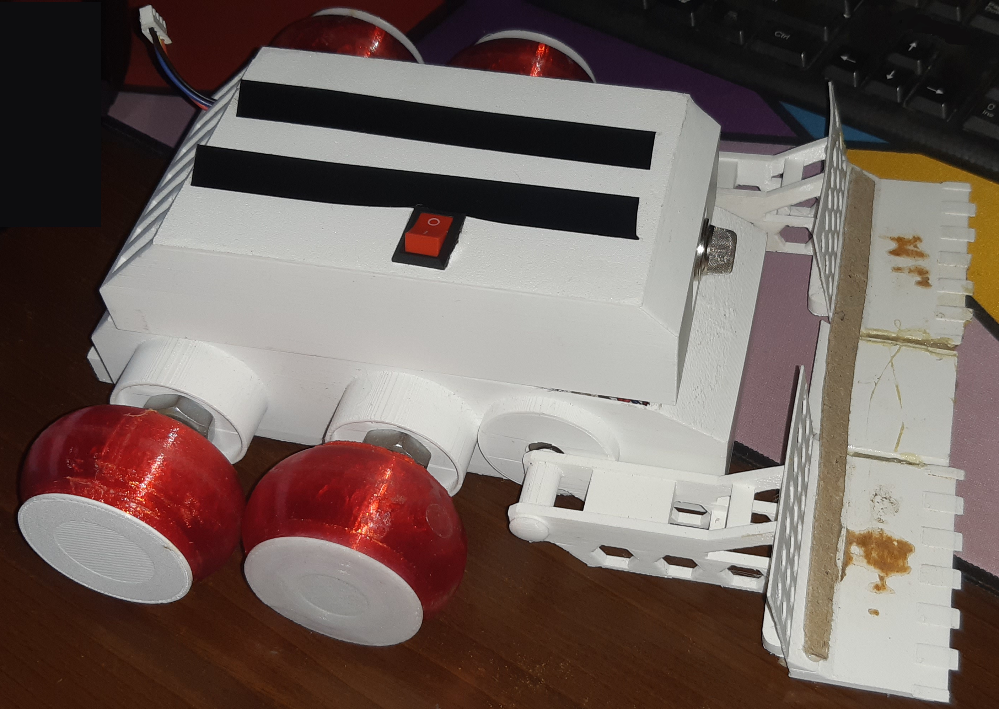
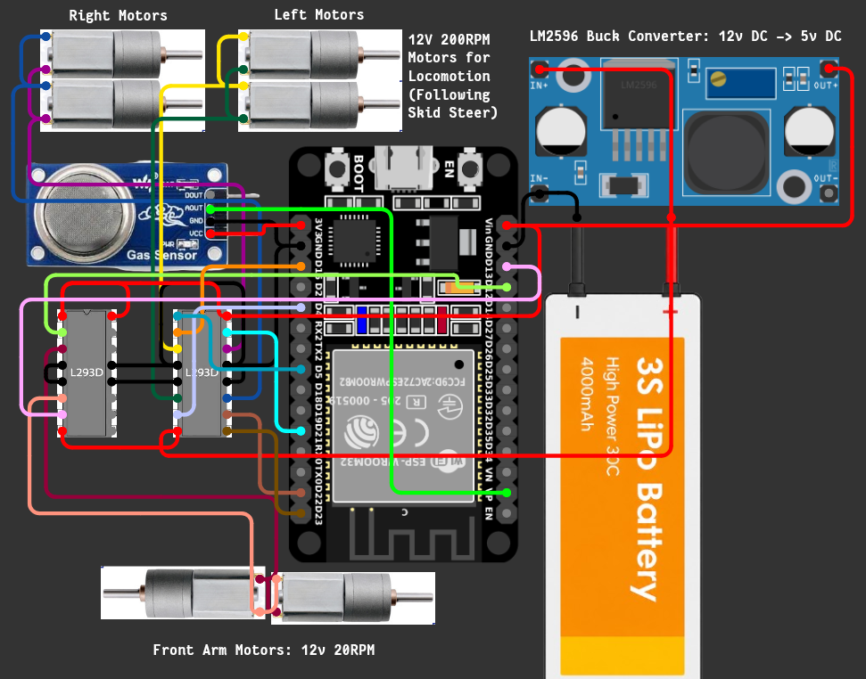
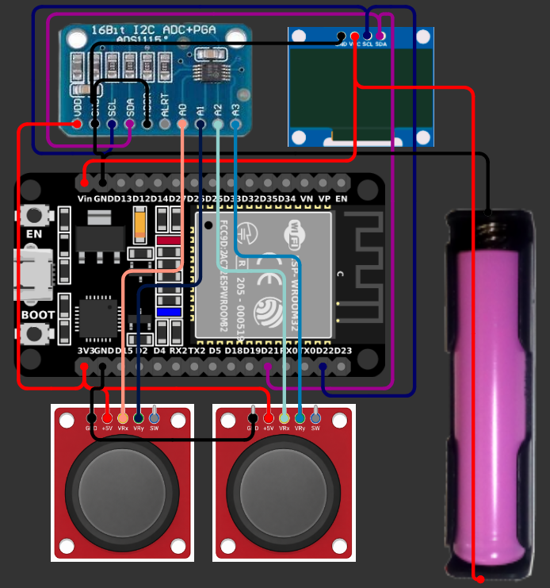

# ATMOS: Post-Disaster Patrolling Device

**ATMOS** (Atmospheric & Terrain Monitoring Operating System) is a remote-controlled rover designed for search-and-rescue operations in post-disaster environments. It navigates hazardous terrain to reach survivors in areas inaccessible to human first responders.

Built to meet strict competition rules ($21 \times 23 \times 14\text{ cm}$ size envelope), this prototype showcases a scalable architecture with immense potential for larger field deployments.

---

## Key Features

- **Modular Design:** Modular chassis and isolated electronic systems for quick field repairs.
- **High-Torque Obstacle Clearance:** Front lifters driven by dual 30 RPM gear motors to clear physical debris.
- **Long-Range Control:** Peer-to-peer ESP-NOW protocol supporting up to ~250m wireless control range without external directional antennas.
- **Toolless Assembly:** Fully 3D-printed interlocking chassis components for toolless maintenance.

---

## Working Principle

Communication between the Remote Controller and ATMOS relies on low-latency bidirectional ESP-NOW messaging over Wi-Fi Channel 6:

1. **Control Telemetry:** The remote reads dual analog joysticks via an ADS1015 I2C ADC, maps positional data into motor drive states (`FWD`, `BWD`, `LEFT`, `RIGHT`) and lifter positions, and broadcasts framed payloads (`M:...`) every 50ms.
2. **Rover Execution:** ATMOS parses control packets asynchronously in its main execution loop, updates motor driver direction states, and applies PWM speed regulation.
3. **Environmental Telemetry:** ATMOS reads the MQ-135 gas sensor every 200ms and broadcasts voltage data back (`G:...`). The remote parses incoming gas readings and updates its SH1106 OLED display asynchronously.

---

## Bill of Materials (BoM)

| Component | Specifications / Model | Quantity | Purpose |
| :--- | :--- | :---: | :--- |
| **Microcontroller** | ESP32-WROOM-32 | 2 | Primary processing & wireless transceiver |
| **Drive Motors** | 12V DC Gear Motor (200 RPM) | 4 | Main 4WD drivetrain |
| **Lifter Motors** | 12V DC Gear Motor (30 RPM) | 2 | High-torque front obstacle clearance |
| **Rover Power** | 3S LiPo Battery (11.1V - 12.6V) | 1 | Drivetrain & high-power supply |
| **Remote Power** | 18650 Li-ion Cell (3.7V) | 1 | Logic & remote control power |
| **Motor Drivers** | L293D Dual H-Bridge IC | 2 | Drivetrain & lifter direction control |
| **Voltage Regulator** | LM2596 DC-DC Buck Converter | 1 | Step-down regulation for ESP32 & logic |
| **External ADC** | ADS1015 / ADS1115 (I2C) | 1 | Precision multi-channel joystick sampling |
| **Display** | 1.3" SH1106 OLED (I2C) | 1 | Real-time telemetry dashboard |
| **Joysticks** | Dual-Axis Analog Thumbsticks | 2 | Drive & lifter control input |
| **Gas Sensor** | MQ-135 Air Quality Module | 1 | Hazardous gas & voltage detection |
| **Hardware** | Custom PCBs, XT60/18650 Connectors, Switches | — | Power distribution & structural routing |

---

## Circuit Diagrams & Schematics

### Rover Unit (ATMOS)

> *Module Layout*

> *System Circuit Diagram*

---

### Remote Control Unit

> *Module Layout*

> *System Circuit Diagram*

---

## Current Limitations & Roadmap

### Limitations

- **Size Restrictions:** Constrained to $21 \times 23 \times 14\text{ cm}$ to meet competition specifications.
- **Weight-to-Power Ratio:** Relatively heavy (~3 kg total mass).
- **Payload Capacity:** No dedicated compartment for emergency medical supplies.

### Future Development

- **All-Terrain Wheel Upgrade:** Implement treaded tires or rocker-bogie suspension for rougher terrain.
- **Medical Payload Bay:** Integrate a servo-driven drop compartment for emergency first-aid kits.
- **First-Person Video Feed:** Integrate a low-latency video transmission system.
